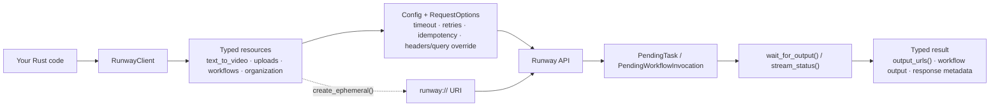

<h1 align="center">runway-rs</h1>
<p align="center">Typed async Rust client for submitting Runway generations, polling task output, uploading media, and running workflows.</p>
<p align="center">
  <a href="https://github.com/AbdelStark/runway-rs/actions/workflows/ci.yml"></a>
  
  
  
  
</p>

## How It Works



Read-only endpoints such as `organization()` and `workflows().list()` are safe smoke tests. Billable generations and ephemeral uploads depend on the account permissions and credits attached to your Runway key.

## Quick Start

1. Clone and build.

```bash
git clone https://github.com/AbdelStark/runway-rs.git
cd runway-rs
cargo build
```

2. Set your Runway secret.

```bash
cp .env.example .env
$EDITOR .env
```

3. Run the safe smoke test example.

```bash
set -a; source .env; set +a
cargo run --example organization
```

```text
Credit balance: <number>
Usage models: <count>
Usage rows: <count>
```

## The Good Stuff

### 1. Submit a text-to-video job and wait for the final asset

```rust
use runway_sdk::{RunwayClient, TextToVideoGen45Request, VideoRatio};

# async fn run() -> Result<(), Box<dyn std::error::Error>> {
let client = RunwayClient::new()?;

let task = client
    .text_to_video()
    .create(TextToVideoGen45Request::new(
        "Aerial shot of a glacier at sunrise",
        VideoRatio::Landscape,
        5,
    ))
    .await?
    .wait_for_output()
    .await?;

println!("{}", task.output_urls().unwrap()[0]);
# Ok(())
# }
```

- `TextToVideoGen45Request` keeps the request model-specific instead of flattening everything into one permissive struct.
- `VideoRatio::Landscape` maps to `1280:720`.
- `wait_for_output()` polls until the task reaches `SUCCEEDED`, `FAILED`, or `CANCELLED`.

### 2. Upload bytes once, reuse the returned `runway://` URI

```rust
use runway_sdk::{
    CreateEphemeralUploadRequest, ImageToVideoGen4TurboRequest, RunwayClient, VideoRatio,
};

# async fn run() -> Result<(), Box<dyn std::error::Error>> {
let client = RunwayClient::new()?;
let bytes = std::fs::read("input.png")?;

let upload = client
    .uploads()
    .create_ephemeral(
        CreateEphemeralUploadRequest::new("input.png", bytes).content_type("image/png"),
    )
    .await?;

let task = client
    .image_to_video()
    .create(
        ImageToVideoGen4TurboRequest::new(upload.uri, VideoRatio::Landscape)
            .prompt_text("Animate the uploaded image"),
    )
    .await?
    .wait_for_output()
    .await?;

println!("{}", task.output_urls().unwrap()[0]);
# Ok(())
# }
```

- `create_ephemeral()` performs the official placeholder + multipart upload flow.
- `upload.uri` is the `runway://...` handle you pass to downstream generation endpoints.
- This path can be gated by Runway billing rules on unfunded accounts.

### 3. Start a workflow without hand-rolling nested JSON

```rust
use runway_sdk::{PrimitiveNodeValue, RunWorkflowRequest, RunwayClient, WorkflowNodeOutputValue};

# async fn run() -> Result<(), Box<dyn std::error::Error>> {
let client = RunwayClient::new()?;
let workflows = client.workflows().list().await?;

let version = &workflows.data[0].versions[0];
let invocation = client
    .workflows()
    .run_pending(
        &version.id,
        RunWorkflowRequest::new().node_output(
            "prompt-node",
            "prompt",
            WorkflowNodeOutputValue::Primitive {
                value: PrimitiveNodeValue::from("hello world"),
            },
        ),
    )
    .await?;

println!("{}", invocation.id());
# Ok(())
# }
```

- `node_output()` builds the `nodeOutputs` map with typed values.
- `run_pending()` returns a `PendingWorkflowInvocation` you can poll just like a generation task.
- `workflow_invocations().pending(id)` is the direct entry point when you already have an invocation ID.

## Configuration / API

| Knob | Default | Description |
| --- | --- | --- |
| `RUNWAYML_API_SECRET` | none | Bearer secret read by `RunwayClient::new()`. |
| `Config::base_url` | `https://api.dev.runwayml.com` | API host override. |
| `Config::api_version` | `2024-11-06` | Sent as `X-Runway-Version`. |
| `Config::timeout` | `300s` | Default HTTP timeout for each request. |
| `Config::max_retries` | `3` | Retries `408`, `409`, `429`, `5xx`, and retryable transport failures. |
| `Config::poll_interval` | `5s` | Delay between task and workflow polls. |
| `Config::max_poll_duration` | `600s` | Max total wait time for `wait_for_output()`. |
| `RequestOptions` | none | Per-request headers, query params, timeout, retries, idempotency key, and base URL override. |
| `live-tests` | off | Enables `tests/live_api.rs` for real API smoke tests. |
| `unstable-endpoints` | off | Enables `lip_sync`, `image_upscale`, and task list/cancel helpers. |

## Deployment / Integration

Run the live smoke suite in GitHub Actions with a real Runway secret:

```yaml
name: runway-live-smoke

on:
  workflow_dispatch:

jobs:
  live:
    runs-on: ubuntu-latest
    env:
      RUNWAYML_API_SECRET: ${{ secrets.RUNWAYML_API_SECRET }}
    steps:
      - uses: actions/checkout@v4
      - uses: dtolnay/rust-toolchain@stable
      - run: cargo test --features live-tests --test live_api -- --nocapture --test-threads=1
```

## License

MIT or Apache-2.0.
